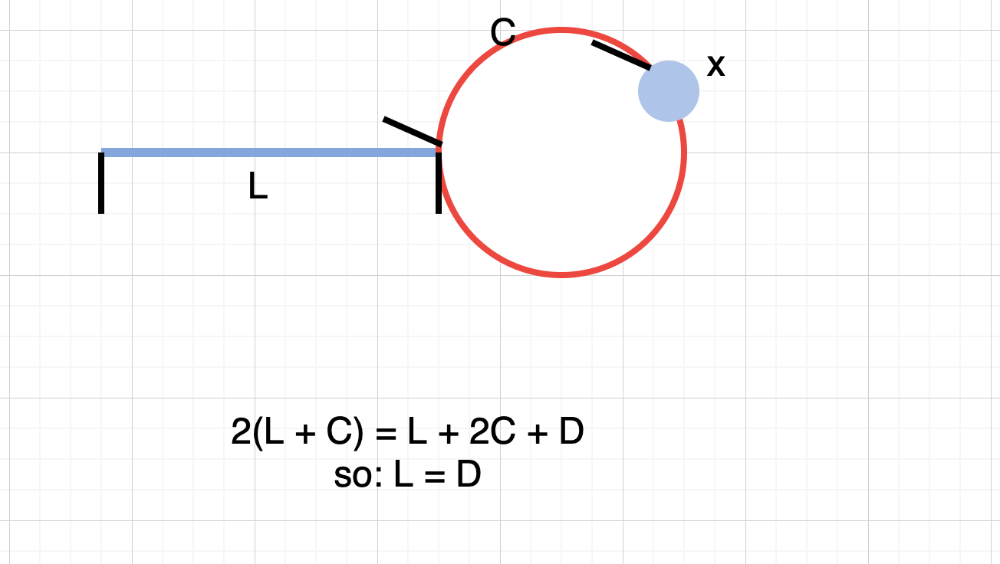

### 思路

假设从链表开始的位置到环入口的距离为 L，慢指针在环内走了的距离为 c，假设慢指针一共走了 n 步，快指针一共走了 2n 步。
那么，有 L+c=n
显然，从 L+c 这一点开始，慢指针再走 n 步，必然还会回到这个点。【 因为经过了 2n 步，快指针到达了这一点，所以慢指针如果再走 n 步，也会到达这一点】
如果让快指针从链表头开始走 n 步，也会到达 L+c 这个位置，二者相遇的第一个地方，肯定是环入口。




### 代码

```python
# Definition for singly-linked list.
# class ListNode(object):
#     def __init__(self, x):
#         self.val = x
#         self.next = None

class Solution(object):
    def detectCycle(self, head):
        """
        :type head: ListNode
        :rtype: ListNode
        """
        slow = fast = head
        while fast and fast.next:
                fast = fast.next.next
                slow = slow.next
                if fast == slow:
                    fast = head
                    while fast != slow:
                        fast = fast.next
                        slow = slow.next
                    return slow
```

